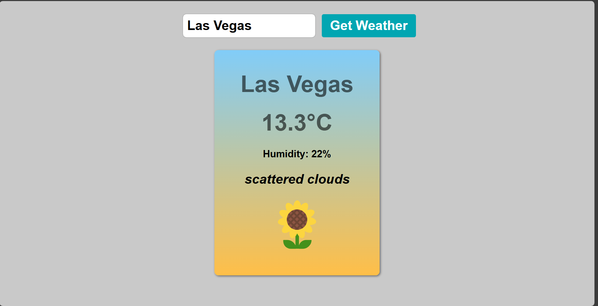

# 🌦️ Weather App  

A sleek and simple web application that displays real-time weather data for any city you search. Powered by a weather API, this app is a perfect way to explore current weather conditions across the globe.  



---

## 🚀 Features  
✨ **City Weather Search**: Get the current weather of any city worldwide by entering its name.  
🌡️ **Detailed Information**: Displays temperature, humidity, wind speed, and weather conditions.  
🎨 **Responsive Design**: Optimized for desktop and mobile devices.  

---

## 🛠️ Technologies Used  
- **Frontend**: HTML, CSS, JavaScript  
- **API**: [OpenWeather]([https://openweathermap.org/](https://openweathermap.org/))  

---

## 🎯 How to Run  
1. Clone the repository:  
   ```bash
   git clone https://github.com/yourusername/weather-app.git
   ```
2. Navigate to the project folder:  
   ```bash
   cd weather-app
   ```
3. Open the `index.html` file in your browser.  

---

## 🌟 Screenshots  


---

## 🤝 Contribution  
Contributions are welcome! Feel free to submit a pull request or open an issue for feature suggestions or bug fixes.  

---

## 📜 License  
This project is licensed under the MIT License. See the [LICENSE](LICENSE) file for more details.  

---

## 📬 Contact  
If you have any questions or feedback, feel free to reach out:  
📧 Email: isuruIndrajith680@gmail.com 
💼 LinkedIn: [Isuru Indrajith](www.linkedin.com/in/isuru-indrajith-387ab7278)  
